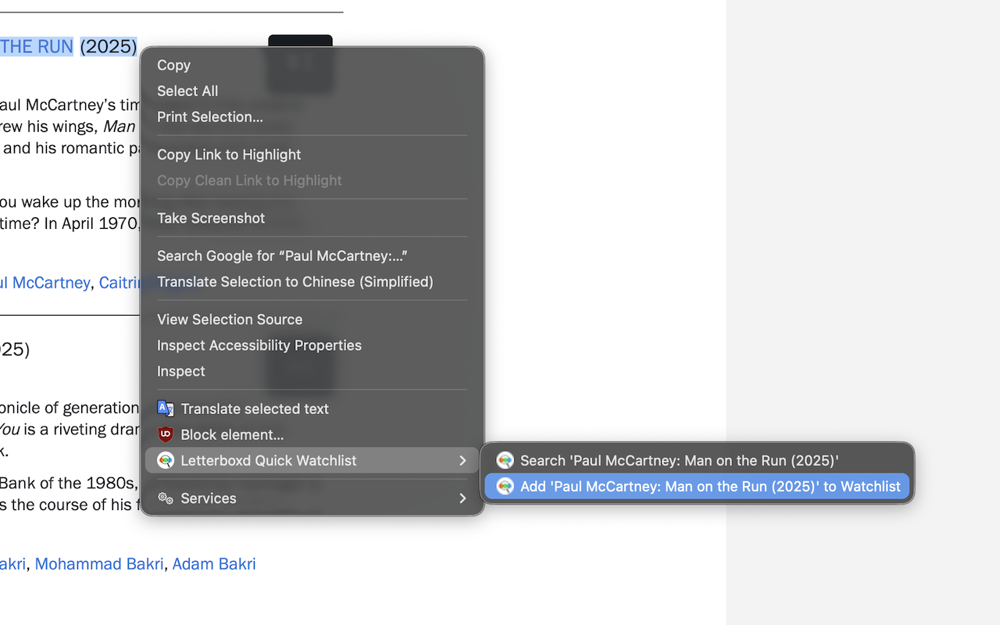

# Letterboxd Quick Watchlist

A browser extension that lets you right-click any selected movie title on the web and either search for it on Letterboxd or add it straight to your watchlist. Works best if you include the year in your query!!

## Features

- **Search xyz** — right-click selected text and search for it on Letterboxd.
- **Add xyz to Watchlist** — right-click selected text, jump to the matching Letterboxd search result, and automatically add it to your watchlist.

## Installing locally (test version)

### Firefox

1. Go to `about:debugging#/runtime/this-firefox`.
2. Click **Load Temporary Add-on**.
3. Select `manifest.json` inside the `firefox/` folder.

### Chrome

1. Go to `chrome://extensions`.
2. Enable **Developer mode**.
3. Click **Load unpacked** and select the `chrome/` folder.

## Permissions

All it does is open a new Letterboxd tab, run a search, and click the first result — super simple, and the code is public, so feel free to take a look!

- `contextMenus` — to add the right-click menu items.
- Host access is limited to `https://letterboxd.com/*` for the content script; no other site data is read or modified.
